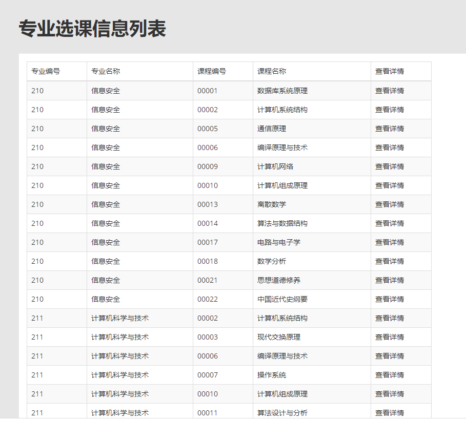

## 项目介绍
- 本项目是本人在大学期间的数据库课程设计，为学生成绩管理系统
- 由于当时时间紧张，只有一周多点的时间，实现的功能较为简单
- 整体架构
    - 后端采用python+flask+mysql的方式，未做服务器部署，可以在单机上测试运行
    - 前端则借鉴了网上找到的前端页面模板，在此基础上修改，主要技术是html+css+js
    - 前后端分离开发，见http接口设计.docx，使用postman等工具进行接口测试
## 目录结构
<pre>
app/ 项目源代码
|--- models/ 后端模型层，用于读写数据库
|--- validate/ 后端验证层，用于验证http请求的参数合法性
|--- web/ 后端控制器层，用于处理http请求
|--- __init__.py 入口函数
|--- static/ 前端静态文件目录
    |--- js/ 前端javascript文件
    |--- *.html 前端html页面文件
sql/ 建库脚本及说明、测试数据脚本
http接口设计.docx
前端页面模板/ 
</pre>

## 项目环境配置
- 下载安装mysql 8
    - 执行 sql/建库脚本-无注释.sql
    - 执行 sql/系统测试数据.sql
- 下载安装python 3.7.3
- IDE: pycharm community
- 依赖第三方库（使用pipenv等工具安装）
    - flask
    - wtforms
    - pymysql
    - flask-login

## 核心要求
### 总体要求
- 基于web的数据库应用系统
- E-R图设计概念模式、导出逻辑模式
- 设计应用系统的系统结构图，确定系统功能
- 创建数据库和表，输入初始数据，要求每个表的记录数不得少于18条
- 不需要连接远程数据库，直接在一个机器上即可
- 分工可以按照学生模块、教师模块、管理员模块、前台界面、数据库设计
- 学院的网站上找老师的信息
- 学生信息输自己班的就行
- 数据库表可以在PPT的基础上扩展
- 可以在PPT的基础上增加功能，功能越完善，分数越高
- 界面做漂亮一些

### 角色需求描述
- 系统交互
    - 登录
        - 无需注册功能
        - 管理员以admin作为用户名，密码为固定值，不可修改
        - 教师以教师编号为用户名，密码默认为教师编号，可修改
        - 学生以学生编号为用户名，密码默认为学生编号，可修改
    - 修改密码
- 学生
    - 查询
        - 学生基本信息
        - 该学生所选的各门课的成绩
- 教师
    - 查询
        - 教师基本信息
        - 所授课程基本信息
        - 学生选课信息
        - 所授课程所有学生的成绩
        - 所授课程所有学生的成绩的统计结果
        - 统计各分数段学生的成绩分布， 画出直方图和饼图。
    - 录入
        - 学生所选课程成绩
    - 修改
        - 学生所选课程成绩
    - 删除
        - 学生所选课程成绩
- 管理员
    - 查询
        - 学生基本信息
        - 教师基本信息
        - 课程基本信息
    - 录入
        - 学生基本信息
        - 教师基本信息
        - 课程基本信息
        - 专业选课信息
    - 修改
        - 学生基本信息
        - 教师基本信息
        - 课程基本信息
    - 删除
        - 学生基本信息
        - 教师基本信息
        - 课程基本信息
        - 专业选课信息
### 部分需求详述
- 学生基本信息
    - 包括学号、姓名、性别、出生年份、籍贯、已修学分、已选课程数量、加权平均学分等；其中已修学分为所有通过的课程的学分和，60分及以上即为通过；加权平均学分根据每门课的学分进行加权。
- 教师基本信息
    - 包括教师编号、姓名、性别、出生年份、所授课程数量等。
- 课程基本信息
    - 包括课程编号、课程名称、开设年份、开设学期、授课教师编号、学分、选课学生数量、平均成绩等；其中平均成绩是所有学生的成绩的算术平均值。
- 专业基本信息
    - 包括专业编号、专业名称等。
- 专业选课功能说明
    - 本系统为学生成绩管理系统，核心功能为学生成绩的管理，但是同时该系统依托于学生选课系统。
    - 我们由此添加了简单的选课功能，遵循小次数大批量的原则，以专业为单位进行选课，若添加了一条专业选课的记录，则该专业的所有学生都将选修该门课程。

## 编号规则
- 学院编号：2位
- 专业编号：
    - 学院编号：2位
    - 学院内专业编号：2位
    - 共：4位
- 班级编号：
    - 入学年份：4位
    - 专业编号：4位
    - 专业内班级编号：2位
    - 共：10位
- 学生编号：
    - 班级编号：10位
    - 班级内序号：2位
    - 共：12位
- 教师编号：
    - 学院编号：2位
    - 学院内编号：3位
    - 共：5位
- 课程编号：5位
- 所有数据库表的id都是用char存的，有一些id设置为了已有的最大值+1，所以在插入数据时，需要查出数据库表中已有的id，转化为整数，取最大值+1，转化为字符串，作为新的id

## 数据库说明
数据库为: Mysql
- 数据库用户名为: root，可在__init__.py中修改
- 数据库密码为: asdfg13579，可在__init__.py中修改

## 其它配置说明
- 端口: 6060，可在__init__.py中修改
- 访问地址为http://localhost:6060
    - 不能用127.0.0.1，因为前端页面里面的超链接是固定的localhost，否则会引起跨域问题
- 管理员用户名为admin，密码为asdfg13579
- 学生和教师的初始密码均为其编号

## 数据流图

## ER图-关系模式

关系模式见sql/建库脚本

## 完整性约束分析
### 实体完整性约束
- 所有的主键均不能为空，所有定义为not null的属性也不能为空。
### 参照完整性约束
- 学生表：学生表的major_id参照专业表的major_id；
若删除某个专业，则级联删除对应学生；
插入学生前，其所属专业必须已被创建；
这样的约束应由外键实现；
- 课程表：课程表的teacher_id参照教师表的teacher_id；
若删除某个教师，则级联删除对应课程；
插入课程前，其授课教师必须已被创建；
这样的约束应由外键实现；
- 专业选课表专业选课表的major_id参照专业表的major_id，专业选课表的course_id参照课程表的course_id；
若删除某个专业，则级联删除对应的专业选课信息；
若删除某个课程，则级联删除对应的专业选课信息；
插入专业选课信息之前，其对应的专业和课程必须已被创建；
这样的约束应由外键实现；
### 自定义完整性约束
| 字段 | 约束 |
| --- | --- |
| major_id | 3位数字，新添加的专业编号自动生成为已有专业编号最大值+1
| student_id | 10位数字，自动生成，新添加的学生编号由4位入学年份、3位专业编号和3位当年专业内已有学生编号最大值+1组成
| course_id | 5位数字，新添加的课程编号自动生成为已有课程编号最大值+1
| teacher_id | 5位数字，新添加的教师编号自动生成为已有教师编号最大值+1
| major_name | unique，不同专业的名称不能相同
| sex | 取值为“男”或“女”
| semester | 取值为“春”或“秋”
| 所有的年份 | 4位数字
| 姓名、名称等 | 不超过20位的字符串
| province | 不超过20位的字符串
| grade | 0~100之间的整数
| credit | 1~10之间的整数

### 学生选课表与触发器
学生选课信息其实可以通过学生表、专业选课表查询得到，但由于需要存储成绩，所以新增了一张学生选课成绩表；

当专业选课表中新增一条记录时，则该专业的学生都要生成对应的选课记录；当专业选课表中删除一条记录时，则该专业的学生都要删除对应的选课记录；能直接操作该表的，只有教师修改成绩的操作；这样的约束，应由触发器实现，触发器定义见建库脚本。

当学生表增加一条记录时，则根据该学生的专业，自动添加学生选课记录；当学生表删除一条记录时，则根据该学生的专业，自动删除学生选课记录；这样的约束也应由触发器实现，触发器语句见建库脚本。

由于定义了触发器，学生选课表也就不再需要设置任何的外键了。

## 效果展示
### 登录界面
- 

### 学生界面
- 个人信息
    - 
- 成绩
    - 
- 修改密码
    - 

### 教师界面
- 个人信息
    - 
- 课程列表
    - 
- 课程详情（学生名单及成绩）
    - 
- 课程成绩统计
    - 
- 修改密码：同学生

### 管理员界面
- 学生信息
    - 列表
        - 
    - 详情/修改
        - 
    - 添加
        - 
- 教师信息
    - 列表
        - 
    - 详情/修改
        - 
    - 添加：略
- 课程信息
    - 列表
        - 
    - 详情/修改
        - 
    - 添加：略
- 专业信息
    - 列表
        - 
    - 详情/修改
        - 
    - 添加：略
- 专业选课信息
    - 列表
        - 
    - 详情
        - 
    - 添加
        - 

